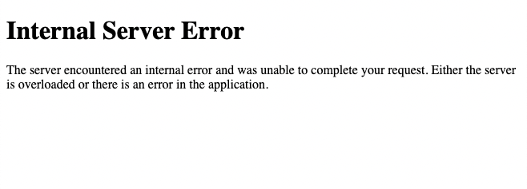

# Detection:

On September 20, 2023 at 22:52:07 a 500 internal server error was discovered shortly after deploying version 2 of the URL Shortner application.  
  

## Impact:

End-users that attempted to use the main functionality of the URL Shortner application experienced a 500 Internal Server Error. The error is triggered when a submission is made using the 'Shorten' button. Other functionality of the application did not look to be affected. However, with the main feature being in a broken state, all productivity reliant on the application has been halted.

# Mitigation:

In order to resolve this issue in a timely manner a rollback to version 1 of the URL Shortner was performed and deployed to production. In Github, a checkout to the “Version 1 of application” hash was performed, committed and pushed to the remote main repository. A Jenkins pipeline build was run successfully deploying URL Shortner version 1 back into production.

# Root Cause:

The cause of this incident directly stems from poor oversight of new code being submitted into the production environment. Had the proper testing and review process been in-place, the Python TypeError would have been found and remediated prior to deployment of URL Shortner version 2.

# Lesson Learned:

- Need a more robust testing policy that includes unit and integration testing.
- A code review policy would be beneficial to assist junior engineers and new hires become more familiar with our workflows.
- Having a Git branching strategy in-place with development and staging branches can help filter out easily overlooked mistakes from reaching the main branch.
